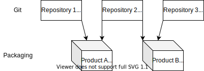
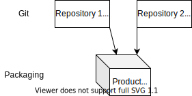

== Development

=== Organizing repositories

Organize git repositories according to link:https://en.wikipedia.org/wiki/Conway%27s_law[Conway's Law] and which product options are provided to customers. Cross repository syntax checks are performed in the pull request process.

=== Example 1

Two separately deployed products, one common library

During packaging, two separately installable artifacts are generated.

Note that the library must be <<_duplicating_code,duplicated>> into each product package.

=== Example 2

One product, two teams with separate responsibilities

=== Quality assurance

abaplint.app and code review guide

https://github.com/SAP/styleguides/releases/download/latest/abap-code-review-guide.pdf

=> use abaplint to check target language syntax

=== Development setups

central development / de-central SAP / open-abap

==== Central Development

one working copy shared by all developers in one system, a single syntax error can impact all developers building and testing in the system

central development: setup automatic push per developer

Central development system cannot be replaced/decommissioned in any setup?

==== De-central Development

allows branching

=> Nuve

==== transpiler / open-abap

cheap branching, but developer heavy

real systems required for final quality gate

==== Summary

[cols="1,1"]
|===
|Setup |Cons

|Central development
|Single working copy

|De-central development
|Extra infrastructure

|transpiler / open-abap
|Extra development effort
|===

=== Duplicating code

https://macwright.com/2021/03/11/vendor-by-default.html

duplicate code with automatic renaming

https://blogs.sap.com/2021/04/20/automagic-standalone-renaming-of-abap-objects/

=== Reducing footprint into SAP

abaplint.app void types

void types notification via abaplint.app

steampunk compatibility

=== Quality gate

Before packaging and distribution, perform a full system test

Including slow test in real systems => Nuve

=== Packaging & Distribution

The product can be delivered to customers using classic transports or via link:https://abapgit.org[abapGit] ZIP files.

abapGit can be used from 7.02 and up, including Steampunk and S/4 HANA Cloud. The customer has full transparency into all changes before performing the import, code review can be done incrementally for each release by the customer. A developer can perform the upload via frontend PC.

Transport files are placed on the application server and imported via classic STMS, note the restrictions if generating transports on different releases than the customer system, link:https://launchpad.support.sap.com/#/notes/1090842[1090842 - Composite SAP Note: Cross-release transports]. The customer cannot review the changes before import, and it requires access to the application server file system to save the transport files.

Note that product development can be done with abapGit, and still employ classic transports for distribution.

=== Versioning/tagging

Everything that is sent to a customer should be tagged in git, this way it is possible to track and reproduce errors locally instead of requiring access to customer systems.

For table contents, customizing and master data, use the abapGit data feature to push the database contents to git.

In case a hotfix is needed for a customer, a branch can be made from the tag, if the customer cannot upgrade to the latest version.

Use a versioning scheme like link:https://semver.org[Semantic Versioning] for the gags.

=== Customer Adjustments

After installation at a customer, the product might need additional adjustments and customizing.

Put all all customer adjustments back to git, possibly a repository for each customer, depending on the actual content.

Do not adjust the product code in the customer system, instead provide the customer with a new release(triggering new versioning), or alternatively provide enhancement points in the product for customer-specific adjustments in customer namespace.